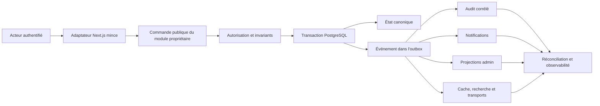

# Toutci — Plan directeur de migration vers le monolithe modulaire et de remise en cohérence métier

- **Date :** 4 septembre 2026
- **Statut :** proposition complète à valider avant exécution
- **Nature :** plan de migration, sans modification fonctionnelle réalisée
- **Sources :** architecture A3, architecture d'authentification, audit global en cinq phases, inventaire fonctionnel et référentiel relationnel du 4 septembre 2026

## 1. Résultat recherché

Le chantier doit produire une application dans laquelle :

1. chaque donnée et chaque règle possèdent un seul module propriétaire ;
2. un compte partenaire porte une activité unique et immuable ;
3. chaque commande métier applique les bons droits, les bonnes cardinalités et les bonnes transactions ;
4. toute action importante laisse une trace corrélée et produit toutes ses conséquences attendues ;
5. l'administration projette fidèlement les données réelles, quel que soit le vertical ;
6. aucune simulation métier n'est accessible dans les parcours opérationnels ;
7. les frontières modulaires sont contrôlées automatiquement par le lint, les tests d'architecture et la CI ;
8. la migration se fait progressivement, sans réécriture globale ni rupture du produit existant.

La cohérence recherchée n'est pas un enchevêtrement de modules. Les modules restent séparés ; leurs interactions passent par des contrats publics, des transactions explicites et des événements métier durables.

## 2. État de départ vérifié

- Le dépôt est déjà un monolithe Next.js 16 avec App Router, Drizzle et PostgreSQL.
- Quatorze modules sont matérialisés dans `src/modules`, mais plusieurs domaines cibles restent dans `src/lib`, `src/components` ou `src/app`.
- Le schéma Drizzle central fait 3 429 lignes et contient 49 tables applicatives.
- La baseline d'architecture autorise encore 108 dépendances `app → DB` réparties dans 57 fichiers.
- Le projet compte actuellement 183 fichiers sous `src/app`, 92 sous `src/modules`, 139 sous `src/lib` et 259 sous `src/components`.
- Les tests d'architecture TypeScript existent déjà ; `eslint-plugin-boundaries`, `dependency-cruiser`, Husky et lint-staged ne sont pas encore installés.
- Les principaux défauts causaux déjà prouvés sont documentés dans `docs/TOUTCI_RELATIONS_METIER_2026-09-04.md`.

## 3. Décisions métier déjà entérinées

Ces décisions deviennent des invariants, pas de simples conventions d'interface.

1. **Un Partner Account égale une activité.** L'activité vaut `restaurant` ou `residence` et ne change pas après création.
2. **Compte Restaurant : un seul Restaurant maximum.** Une fois l'onboarding terminé, il en possède exactement un.
3. **Autonomie des Restaurants.** Deux Restaurants n'échangent implicitement ni abonnement, ni KYC, ni paiement, ni menu, ni commande, ni commission.
4. **Compte Résidence : plusieurs Résidences.** Elles partagent les droits
   commerciaux du compte. Le quota porte uniquement sur les Résidences publiées
   et effectivement visibles dans l'application ; les brouillons et Résidences
   non visibles ne consomment pas de place.
5. **Abonnement au niveau du Partner Account.** Il bénéficie uniquement à l'activité de ce compte.
6. **KYC au niveau du Partner Account.** Il vérifie le propriétaire légal du compte et ne traverse jamais vers un autre compte.
7. **Paiement attribué par la session.** Le Partner Account initiateur est dérivé côté serveur ; il n'est jamais librement choisi par le navigateur.
8. **Aucune synchronisation inter-comptes.** Un paiement Restaurant ne peut pas activer un compte Résidence, et inversement.
9. **Zéro simulation opérationnelle.** Une réussite affichée doit correspondre à une écriture canonique confirmée.
10. **Les données de test sont isolées ou explicitement marquées.** Elles ne peuvent pas être confondues avec des données réelles.
11. **Refonte UI complète autorisée et requise.** L'interface actuelle n'est pas
    une cible de compatibilité visuelle. Chaque écran peut être reconçu ou
    réécrit pendant la migration de son domaine afin d'obtenir une expérience
    cohérente, ergonomique, accessible et responsive, sans modifier
    implicitement les invariants métier.

## 4. Décisions d'architecture à valider avant la première migration

Le document de migration fourni et l'architecture A3 actuelle divergent sur trois points. Ils doivent être tranchés avant tout déplacement.

| Décision | Option recommandée | Pourquoi |
|---|---|---|
| Surface publique d'un module | Conserver les surfaces explicites `model.ts`, `contracts.ts`, `server.ts` et `presentation/`, sans barrel racine | Un `index.ts` global mélange facilement code client et serveur, élargit les API et masque les dépendances. |
| Schéma Drizzle | Conserver temporairement un assemblage central dans `infrastructure/db/schema`, puis réévaluer son découpage après disparition de `app → DB` | Déplacer les tables pendant la migration des comportements cumulerait deux risques difficiles à isoler. |
| Authentification | Conserver le comportement de `docs/architecture-auth.md`; placer les politiques d'accès dans une surface Auth et les mécanismes JWT/cookie/révocation dans `infrastructure/auth` | `shared/` doit rester pur et ne doit pas devenir un tiroir de sécurité dépendant de DB, cookies ou secrets. |
| Résolution des composants UI | Appliquer le skill global `app-components-registry` : beUI d'abord, shadcn/ui ensuite ; utiliser directement le bloc dashboard shadcn/ui pour les shells de dashboard | Une source et un ordre communs empêchent les widgets isolés et les interfaces visuellement décousues. |
| Cohérence de présentation | Centraliser primitives et langage visuel dans `shared/ui`, garder les compositions métier dans `modules/*/presentation`, et autoriser la reconstruction des écrans obsolètes | La séparation par domaine organise le code sans créer un design différent pour chaque domaine. |

Les décisions produit sont arrêtées comme suit :

1. le quota Résidence compte uniquement les Résidences publiées et visibles dans
   l'application ; un brouillon ou une Résidence non visible ne consomme pas le
   quota ;
2. une même personne possédant plusieurs Restaurants utilise des Partner
   Accounts autonomes ; un éventuel accès multi-comptes ultérieur ne devra jamais
   les fusionner ;
3. un compte Résidence partage en V1 un seul profil de versement entre ses
   Résidences.

## 5. Architecture cible proposée

### 5.1 Flux d'une action métier

### 5.2 Règle de cohérence

Les effets sont répartis en trois catégories.

| Catégorie | Exemples | Garantie |
|---|---|---|
| Critique et atomique | état principal, propriété, transaction financière, période d'abonnement, quotas figés, commission obligatoire, événement outbox | Même transaction PostgreSQL : tout réussit ou tout échoue. |
| Différé mais obligatoire | notification, projection admin persistée, invalidation de cache, push, index de recherche | Outbox durable, traitement idempotent, reprise automatique et état d'échec observable. |
| Dérivé et réconciliable | compteurs, statistiques, indicateurs de tableau de bord | Recalculable depuis les sources canoniques et contrôlé par un job de réconciliation. |

Un appel réseau à Paystack, R2, Expo ou Web Push ne doit pas être inclus dans une transaction DB longue. La preuve de l'intention est d'abord persistée ; le résultat fournisseur est ensuite corrélé et finalisé de manière idempotente.

### 5.3 Racines du code

| Racine | Responsabilité | Interdictions principales |
|---|---|---|
| `src/app` | Pages, Route Handlers, Server Actions et composition UI | Pas de Drizzle, pas de règle métier, pas d'import `_internal`. |
| `src/modules` | Modèles, contrats, commandes, queries et persistance propres aux domaines | Pas d'import depuis `app`; pas d'internal étranger. |
| `src/shared` | UI générique et primitives pures réellement utilisées par plusieurs modules | Pas de DB, secret, Next.js serveur ou dépendance vers un module. |
| `src/infrastructure` | DB, cache, auth technique, stockage, Paystack, queue/outbox, push, realtime, logger, rate-limit | Pas de décision métier ni de texte produit. |

### 5.4 Catalogue cible proposé

Le catalogue final doit être validé par Tobias lors du point de contrôle de la cartographie.

| Module | Propriété métier | État de migration attendu |
|---|---|---|
| `auth` | Authentification, sessions et politiques communes d'accès | Extraire les règles encore dispersées sans changer les transports documentés. |
| `admin-accounts` | Cycle de vie des identités administrateur | Conserver un périmètre étroit ; ne pas en faire le propriétaire de tous les comptes. |
| `partners` | Partner Accounts, activité unique et contexte partenaire | Devient la source canonique de l'activité et du compte courant. |
| `clients` | Profil consommateur et ses invariants | Matérialiser le module actuellement encore dispersé. |
| `restaurants` | Restaurant, profil, visibilité et configuration d'établissement | Achever l'extraction des queries/actions legacy. |
| `menu` | Catégories, plats, disponibilité et éligibilité commerciale | Matérialiser et fermer les variantes d'écriture non sûres. |
| `residences` | Résidences, calendrier, visibilité, réservation et séjours | Conserver les règles propres au vertical et corriger le quota. |
| `service-markets` | Marchés géographiques, versions et capacités par activité | Conserver indépendant des verticaux. |
| `discovery` | Classement, exposition sponsorisée et attribution | Recevoir des ressources éligibles ; ne pas décider leur éligibilité métier. |
| `identity` | KYC du Partner Account et décisions d'éligibilité | Ajouter les effets corrélés et l'aperçu privé contrôlé. |
| `subscriptions` | Catalogue, demandes, périodes et transitions d'abonnement | Une seule finalisation canonique pour tous les moyens de paiement. |
| `quotas` | Droits effectifs dérivés de la période active | Aucun calcul de quota dupliqué dans les verticaux ou l'UI. |
| `transactions` | Obligations financières, tentatives, confirmations, versements et remboursement V1 | Le remboursement reste ici tant que son cycle ne justifie pas un module autonome. |
| `commissions` | Politique, snapshot, dette, allocations et règlements | Une source exacte, un Partner Account exact et une traçabilité égale entre canaux. |
| `orders` | Création et cycle de vie des commandes Restaurant | Orchestration publique unique, sans logique concurrente dans `app` ou `lib`. |
| `deliveries` | Livreurs, offres, missions, preuves et espèces | Conserver ses invariants forts et ses acteurs dédiés. |
| `notifications` | Notification produit et destinations typées | La livraison Push/SSE reste en infrastructure. |
| `audit` | Sémantique de trace, acteurs typés et corrélation | Remplacer le modèle centré uniquement sur l'administrateur. |
| `media` | Registre des assets publics, rattachement et nettoyage | Les documents KYC privés restent possédés par Identity et stockés séparément. |

Le futur vertical Événement n'entre pas dans cette migration tant qu'il n'existe ni schéma, ni parcours, ni décision de cardinalité. Il ne doit pas être exposé comme activité active.

### 5.5 Shared kernel proposé

Seuls les concepts suivants sont candidats :

- primitives UI accessibles et sans vocabulaire métier ;
- argent FCFA/BPS et arrondis purs ;
- pagination ;
- temps et intervalles purs lorsqu'au moins deux modules les utilisent ;
- géométrie pure sans accès DB ;
- enveloppe technique minimale de corrélation, sans enum métier global.

Les dossiers globaux `types`, `constants`, `helpers`, `services` ou `utils` sont interdits. Une fonction utilisée par un seul module descend dans ce module.

## 6. Contrats causaux prioritaires

Ces scénarios deviennent la première matrice de traçabilité. Chaque ligne doit avoir un test d'intégration et, pour les parcours critiques, un E2E.

| Action | Propriétaire de la commande | Écritures atomiques | Effets et projections obligatoires |
|---|---|---|---|
| Finir l'inscription Restaurant | Partners + Restaurants | compte `restaurant`, Restaurant unique, état onboarding | audit, file admin, vue Comptes et accès, navigation Restaurant. |
| Finir l'inscription Résidence | Partners + Residences | compte `residence`, première Résidence si créée | audit, file admin, compteur/quota, vue Comptes et accès, navigation Résidence. |
| Ajouter un second Restaurant au même compte | Restaurants | aucune | refus explicite, trace de sécurité si nécessaire. |
| Ajouter une Résidence | Residences + Quotas | Résidence liée au bon compte si quota disponible | compteur/quota, file de modération, projection admin. |
| Soumettre puis décider un KYC | Identity | dossier, documents, état, événement | aperçu inline sécurisé, audit, notification, recalcul d'éligibilité. |
| Initier un abonnement | Subscriptions + Transactions | demande et transaction liées au Partner Account de session | paiement reprenable, historique partenaire/admin, corrélation. |
| Confirmer l'abonnement Paystack | Transactions + Subscriptions + Quotas | paiement, transaction, période, limites, événement | audit, notification, journal financier, offre effective visible. |
| Valider un abonnement hors ligne | Même commande de finalisation | même état final, preuve différente | exactement les mêmes effets que Paystack. |
| Créer/payer une commande | Orders + Transactions + Commissions | commande, lignes, transaction, paiement, commission | notifications, SSE, compteurs réconciliables, admin. |
| Créer/payer une réservation | Residences + Transactions + Commissions | réservation, transaction, paiement, commission | calendrier, notifications, attribution, admin. |
| Annuler une opération payée | Module source + Transactions | annulation et obligation de remboursement | notification, audit, dossier support et état fournisseur. |
| Exécuter une livraison | Deliveries + Orders | mission, preuve, transitions, espèces | événements, notifications, statut commande et visibilité des acteurs. |
| Régler une dette de commission | Commissions + Transactions | règlement, paiement, allocations | solde, reçu, audit, notification, journal financier. |
| Exécuter cron/webhook/worker | Module concerné | état + acteur `system` ou `provider` + corrélation | audit fidèle, retry, alerte en cas d'échec durable. |
| Téléverser puis rattacher un média | Media + module cible | asset temporaire puis lien atomique | propriété, statut rattaché, suppression des abandons. |

## 7. Plan d'exécution par phases

Chaque phase se termine par un point de contrôle humain. Aucune phase suivante ne commence automatiquement.

La refonte UI est un fil transverse de la migration, pas un lot cosmétique
repoussé à la fin. Toute phase qui migre un domaine reprend également ses écrans
et composants concernés à partir d'une fondation visuelle commune. La phase ne
peut être déclarée terminée qu'après vérification des états vide, chargement,
erreur, succès et désactivé, du responsive, du clavier, du focus et de
l'accessibilité. L'interface historique n'impose aucune fidélité visuelle.

### Phase 0 — Cartographie exhaustive, lecture seule

**But :** établir l'état réel avant tout déplacement.

Travaux :

1. inventorier les imports, appels, actions, queries, composants, hooks et types ;
2. classer chaque fichier par propriétaire métier ou par primitive transverse ;
3. dresser la matrice complète des 49 tables et de leurs lecteurs/écrivains ;
4. lister toutes les écritures DB provenant encore de `app` ou de `src/lib` ;
5. dresser la matrice action → commande → tables → événement → effets → écrans ;
6. recenser les simulations, données de test et projections sans source ;
7. détecter cycles, imports internes étrangers et règles dupliquées ;
8. inventorier sans exception les routes, écrans, layouts et composants UI, leur
   propriétaire métier, leurs états, leurs ruptures ergonomiques, visuelles,
   responsive et d'accessibilité, ainsi que les doublons et primitives locales ;
9. associer chaque besoin de composant à l'existant, à beUI ou à shadcn/ui selon
   `app-components-registry`, en identifiant les manques sans encore réécrire l'UI ;
10. produire `AUDIT-MODULARISATION.md` et `AUDIT-INTERFACES.md` avec les
    ambiguïtés à décider et l'ordre recommandé de reprise des interfaces.

**Sortie :** aucune modification de code ; catalogue des modules, ownership des
tables et dépendances validés par Tobias ; inventaire exhaustif des interfaces,
fondation visuelle cible et rattachement de chaque écran à sa phase métier.

### Phase 1 — Filet de sécurité et données de test isolées

**But :** rendre la migration mesurable et réversible.

Travaux :

1. utiliser la `DATABASE_URL` Neon actuelle, explicitement désignée par Tobias
   comme base de développement/test et jamais comme production ; aucune
   `DATABASE_URL_TEST` séparée n'est requise pour ce projet tant que cette
   décision n'est pas révoquée ;
2. créer des fixtures identifiables par origine/scénario et un nettoyage relationnel ;
3. écrire les tests de caractérisation des parcours actuels avant de les déplacer ;
4. transformer la matrice causale prioritaire en tests d'intégration DB ;
5. ajouter des tests négatifs de propriété inter-compte et inter-activité ;
6. conserver un snapshot anonymisé des anomalies historiques pour tester les scripts de réconciliation ;
7. documenter sauvegarde, rollback et procédure de restauration.

**Sortie :** typecheck, lint, tests d'architecture et tests de caractérisation
verts ; toute mutation de test sur la Neon de développement/test est bornée par
un identifiant de scénario puis annulée ou nettoyée relationnellement.

### Phase 2 — Outillage de frontières, sans déplacement métier

**But :** empêcher que la dette augmente pendant la migration.

Travaux :

1. conserver les tests d'architecture TypeScript existants comme contrôle principal ;
2. ajouter `eslint-plugin-boundaries` avec la matrice de dépendances validée ;
3. ajouter `no-restricted-imports` pour interdire les `_internal` étrangers et les surfaces non publiques ;
4. ajouter dependency-cruiser pour les cycles et les dépendances interdites ;
5. installer Husky + lint-staged pour les fichiers modifiés ;
6. ajouter les mêmes contrôles en CI ;
7. maintenir les violations existantes sous forme de ratchets exacts ; aucune nouvelle violation n'est autorisée ;
8. ne créer aucun dossier vide : une surface apparaît avec son premier vrai fichier.

**Sortie :** outillage vert sur l'état existant et preuve qu'une violation volontaire de test est bloquée.

### Phase 3 — Fondation de causalité et de traçabilité

**But :** fournir un mécanisme commun avant de corriger les flux transversaux.

Travaux :

1. définir l'enveloppe `eventId`, `correlationId`, type, acteur, Partner Account, cible et date ;
2. élargir Audit aux acteurs `admin`, `partner`, `client`, `driver`, `system` et `provider` ;
3. introduire une outbox transactionnelle PostgreSQL ;
4. rendre les consommateurs idempotents avec retry, statut et dead-letter observable ;
5. définir les politiques de rétention et interdire les données sensibles dans les payloads ;
6. créer les outils de réconciliation entre événements, effets et état canonique ;
7. migrer un flux pilote peu risqué avant les paiements.

**Sortie :** une commande pilote prouve écriture atomique, événement, audit, effet différé, reprise et absence de doublon.

### Phase 4 — Partners, Auth et modèle de compte

**But :** rendre le contrat mono-activité incontournable partout.

Travaux :

1. faire de Partners l'unique source de `PartnerAccount` et `activityType` ;
2. rendre l'activité immuable dans le modèle, les commandes et la DB ;
3. dériver le compte courant de la session côté serveur ;
4. interdire les créations Restaurant/Résidence croisées ;
5. garantir l'unicité Restaurant/Partner Account ;
6. appliquer le quota Résidence selon la décision validée ;
7. réconcilier les partenaires sans compte, le compte associé à un admin et les comptes sans entité ;
8. préserver sans changement les cookies, JWT, refresh et protections décrits dans `docs/architecture-auth.md` ;
9. remplacer la projection « Restaurant & offre » par un DTO discriminé Restaurant/Résidence.

**Sortie :** les scénarios de cardinalité et d'isolation inter-comptes passent en DB et dans Comptes et accès.

### Phase 5 — Identity et Media

**But :** sécuriser le KYC et le cycle de vie des fichiers.

Travaux :

1. faire servir les documents KYC en `inline`, `private`, `no-store`, après autorisation et état antivirus/CDR ;
2. intégrer un lecteur image/PDF dans la revue admin ;
3. séparer explicitement l'action Télécharger et la journaliser si elle reste autorisée ;
4. émettre audit, notification et recalcul d'éligibilité pour toute décision KYC ;
5. créer le registre d'assets publics temporaires/rattachés ;
6. rattacher l'asset dans la transaction de la ressource cible ;
7. nettoyer les uploads abandonnés ;
8. conserver le stockage KYC privé totalement séparé des médias publics.

**Sortie :** aucun document KYC n'est public ni téléchargé involontairement ; aucun nouvel upload public ne reste orphelin.

### Phase 6 — Transactions, abonnements, quotas et remboursements

**But :** unifier tous les chemins financiers et rendre leurs effets visibles.

Travaux :

1. confirmer Transactions comme source unique des obligations et Payments comme historique des tentatives ;
2. enregistrer le Partner Account initiateur dès la demande, à partir de la session ;
3. unifier la finalisation d'abonnement Paystack et hors ligne dans une commande idempotente ;
4. garantir atomiquement paiement confirmé, transaction payée, période active, limites correctes et événement ;
5. ajouter audit, notification et journal financier pour tous les canaux ;
6. afficher montant, fournisseur, moyen, référence, dates, source, compte et droit créé dans l'administration ;
7. gérer correctement expiration et suspension avec acteur système ;
8. introduire l'obligation de remboursement liée au paiement d'origine ;
9. supprimer le compteur fictif de remboursements jusqu'à ce qu'il lise cette source réelle ;
10. produire un script de diagnostic pour le paiement de 25 000 FCFA et les anomalies historiques, sans réattribution automatique non prouvée.

**Sortie :** les paiements en ligne/hors ligne aboutissent au même état et aux mêmes conséquences ; aucun droit ne traverse un autre compte.

### Phase 7 — Restaurants et Menu

**But :** terminer un premier vertical autonome de bout en bout.

Travaux :

1. migrer les règles Restaurant restantes hors de `src/lib` et `app` ;
2. matérialiser Menu avec catégories, plats, disponibilité et quotas ;
3. fermer la création de plat avec une catégorie appartenant à un autre Restaurant ;
4. centraliser visibilité, ouverture et capacité de commande sans fusionner leurs sens ;
5. faire consommer les commandes et l'UI uniquement par les surfaces publiques ;
6. retirer le vocabulaire « démonstration » des écritures réelles ;
7. migrer les composants métier dans `presentation/` et garder les primitives dans `shared/ui`.

**Sortie :** un compte Restaurant ne voit et ne modifie que son Restaurant, son menu et ses droits ; aucun accès DB direct depuis ses adaptateurs.

### Phase 8 — Residences

**But :** rendre le vertical multi-résidences cohérent avec le compte et ses quotas.

Travaux :

1. centraliser création, modification, modération, publication et calendrier ;
2. appliquer le quota à l'événement décidé, sans calcul local concurrent ;
3. faire hériter toutes les Résidences du même abonnement du compte sans copie de statut ;
4. harmoniser ou documenter les différences de remodération avec Restaurant ;
5. connecter notifications et destinations navigables de l'espace Résidence ;
6. sécuriser réservations, annulations payées et obligations de remboursement ;
7. exposer au partenaire et à l'admin les listes, statuts, quotas et raisons de blocage réels.

**Sortie :** le compte Résidence gère exactement la collection autorisée, et chaque action se reflète dans calendrier, admin, notifications et finance.

### Phase 9 — Clients, Orders, Commissions et Deliveries

**But :** fermer la chaîne opérationnelle Restaurant de la commande à la remise d'espèces.

Travaux :

1. matérialiser Clients et supprimer les accès directs dispersés à ses données ;
2. migrer toute création/transition de commande vers les commandes publiques Orders ;
3. garantir l'alignement commande, transaction, paiement et commission ;
4. backfiller ou marquer explicitement les commandes historiques incomplètes ;
5. remplacer les compteurs clients/restaurants/plats non fiables par des projections recalculables ;
6. préserver les invariants existants des offres, missions, preuves et espèces Delivery ;
7. rendre les règlements de commission Paystack et hors ligne symétriques ;
8. vérifier toutes les transitions et tous les droits par acteur.

**Sortie :** commandes cash/en ligne, commissions et livraisons produisent des états cohérents et réconciliables.

### Phase 10 — Notifications, Audit, Discovery et projections administrateur

**But :** rendre visibles et navigables les conséquences de tous les modules.

Travaux :

1. remplacer les destinations texte fragiles par des destinations typées résolues centralement ;
2. définir le comportement d'une cible archivée ;
3. migrer les 235 notifications actuellement orphelines selon une politique approuvée ;
4. faire consommer Audit et Notifications depuis les événements corrélés ;
5. construire les projections admin depuis les contrats publics des modules ou depuis des read models possédés ;
6. couvrir Comptes et accès, abonnements, paiements, KYC, modérations, remboursements et actions système ;
7. rendre Discovery consommateur d'éligibilités, sans dupliquer les règles Restaurant/Résidence ;
8. ajouter des contrôles de dérive et une reconstruction des projections.

**Sortie :** toute donnée affichée dans l'administration est traçable jusqu'à sa source canonique et actualisable après incident.

### Phase 11 — Suppression des simulations et assainissement des données

**But :** garantir que le produit ne prétend jamais avoir exécuté une action fictive.

Travaux :

1. supprimer des builds opérationnels `StepSocials`, les faux avis, la fausse réservation de table et la galerie statique trompeuse ;
2. déplacer les démonstrations utiles dans un environnement explicitement non produit, ou les supprimer ;
3. masquer Promotions, Avis, Favoris et Messagerie tant qu'un parcours persistant complet n'existe pas ;
4. rechercher les délais artificiels, succès locaux, compteurs codés en dur et données de secours présentées comme réelles ;
5. introduire `data_origin` ou une séparation d'environnement stricte ;
6. nettoyer les fixtures seulement avec un rapport d'impact et une opération récupérable ;
7. ajouter un test interdisant l'import des composants de démonstration dans les routes produit.

**Sortie :** zéro simulation métier accessible ; les données réelles et de test sont identifiables sans heuristique sur les noms.

### Phase 12 — Extraction du shared kernel et extinction de `src/lib`

**But :** achever la séparation physique après stabilisation des comportements.

Pour chaque module, dans l'ordre du graphe de dépendances :

1. relire `model.ts`, `contracts.ts`, puis `server.ts` ;
2. déplacer d'abord les règles pures et contrats ;
3. déplacer ensuite queries, commandes et persistance dans `_internal` ;
4. convertir Route Handlers et Server Actions en adaptateurs minces ;
5. convertir les imports externes vers les seules surfaces publiques ;
6. supprimer le bridge dès que son dernier consommateur a migré ;
7. descendre dans le module tout fichier `shared` utilisé par un seul domaine ;
8. réduire la baseline `app → DB` à chaque commit jusqu'à zéro ;
9. ne jamais augmenter une baseline pour faire passer le CI.

Ordre recommandé : primitives pures → Partners/Auth/Clients → Service Markets → Identity/Media → Transactions → Subscriptions/Quotas → Restaurants/Menu → Residences → Commissions → Orders → Deliveries → Discovery → Notifications/Audit.

**Sortie :** aucune logique métier nouvelle dans `src/lib`, aucun import DB depuis `app`, aucun bridge sans date de suppression.

### Phase 13 — Enforcement bloquant et documentation canonique

**But :** rendre l'architecture impossible à contourner silencieusement.

Travaux :

1. passer toutes les règles de frontières en erreur ;
2. supprimer les baselines arrivées à zéro ;
3. refuser cycles, barrels interdits, imports `_internal`, Client → Server et Shared → Module ;
4. bloquer CI sur typecheck, lint, architecture, dependency-cruiser et tests ciblés ;
5. vérifier réellement le hook pre-commit avec une violation temporaire non commitée ;
6. mettre à jour `ARCHITECTURE.md`, la carte des modules et la matrice de dépendances ;
7. documenter comment ajouter une commande, un événement, une table et une projection.

**Sortie :** zéro violation réelle et documentation alignée sur le code final.

### Phase 14 — Réconciliation finale et pilote de test réel

**But :** prouver l'harmonie du système avec des données contrôlées, pas seulement par analyse statique.

Travaux :

1. exécuter les migrations selon `expand → audit → backfill → verify → enforce → contract` ;
2. produire un rapport anonymisé de toutes les anomalies corrigées ou explicitement mises en quarantaine ;
3. exécuter la matrice d'acceptation complète sur base isolée ;
4. rejouer les parcours Restaurant et Résidence avec Paystack TEST réel ;
5. vérifier les documents KYC inline sans téléchargement involontaire ;
6. vérifier l'administration après chaque action, y compris le paiement de 25 000 FCFA ;
7. vérifier outbox, retries, absence de doublons, notifications, audit et projections ;
8. exécuter typecheck, lint, tests, architecture, E2E, build et contrôles de migration ;
9. ouvrir ensuite seulement une phase pilote avec jeux de données clairement identifiés.

**Sortie :** décision `GO/NO-GO` fondée sur les preuves de chaque parcours et non sur la seule réussite du build.

## 8. Méthode de migration d'un module

Chaque module suit exactement le même cycle, dans un commit ou une PR atomique :

1. confirmer son propriétaire, ses tables, ses API et ses dépendances ;
2. écrire ou compléter ses tests de caractérisation ;
3. déplacer ses types et règles pures ;
4. déplacer ses contrats Zod/DTO sans exposer de rows Drizzle ;
5. déplacer ses lectures et écritures dans l'implémentation privée ;
6. exposer la plus petite surface publique utile ;
7. remplacer les accès directs de `app` et des autres modules ;
8. comparer ancien et nouveau résultat sur des données identiques ;
9. supprimer les anciennes branches et réduire les baselines ;
10. valider typecheck, lint, architecture, tests unitaires, intégration DB et E2E ciblé ;
11. mettre à jour la carte d'ownership et arrêter avant le module suivant.

## 9. Stratégie de migrations de données

Toute évolution structurelle suit ce protocole :

1. **Expand :** ajouter les nouvelles colonnes/tables/contraintes non bloquantes.
2. **Audit :** produire les lignes incompatibles sans les modifier.
3. **Backfill :** corriger seulement les cas prouvés, par script idempotent et journalisé.
4. **Shadow read :** comparer ancienne et nouvelle projection sans changer l'affichage.
5. **Verify :** exécuter les requêtes d'invariants et les tests DB.
6. **Enforce :** rendre les contraintes obligatoires après disparition des anomalies.
7. **Switch :** basculer les lecteurs/écrivains vers la source canonique.
8. **Contract :** retirer l'ancien champ ou l'ancienne table dans un lot ultérieur.

Aucune donnée financière, KYC ou de compte n'est supprimée automatiquement. Les cas ambigus sont mis en quarantaine logique et soumis à validation.

## 10. Matrice minimale d'acceptation finale

| Scénario | Résultat obligatoire |
|---|---|
| Inscription Restaurant complète | Un compte `restaurant`, un Restaurant, aucune Résidence, projection admin exacte. |
| Tentative de second Restaurant | Refus avant écriture. |
| Inscription Résidence complète | Un compte `residence`, collection de Résidences visible, aucune relation Restaurant. |
| Ajout jusqu'au quota puis dépassement | Compteur exact ; dépassement refusé avant écriture ou dirigé vers l'upgrade. |
| KYC soumis/validé/rejeté | Aperçu inline, état, audit, notification et éligibilité cohérents. |
| Abonnement Paystack 25 000 FCFA | Compte initiateur exact, paiement confirmé, période, limites, audit, notification et ligne financière admin. |
| Abonnement hors ligne équivalent | Même état final et mêmes effets, sauf preuve fournisseur. |
| Commande cash et en ligne | Commande, transaction, paiement, commission, notifications et compteurs cohérents. |
| Réservation payée puis annulée | Obligation de remboursement et visibilité support/admin. |
| Livraison avec espèces | Mission, preuve, collecte, remise et transitions corrélées. |
| Règlement de commission selon chaque canal | Allocations, solde, audit, notification et reçu identiques. |
| Cron ou webhook | Acteur système/fournisseur, idempotence et audit corrects. |
| Upload abandonné | Asset temporaire supprimé après délai. |
| Fixture supprimée | Aucun lien de notification réel cassé ; origine test explicite. |
| Contrôle architectural | Zéro `app → DB`, zéro internal étranger, zéro cycle interdit. |

## 11. Critères de sortie globaux

Le chantier n'est terminé que lorsque :

- le catalogue et le graphe des modules sont validés et reflétés dans le code ;
- les 108 dépendances `app → DB` sont réduites à zéro ;
- aucune règle métier n'est dupliquée dans `app`, `components` ou `src/lib` ;
- chaque table a un propriétaire unique documenté ;
- chaque commande critique possède autorisation, invariants, transaction, idempotence, événement, audit et tests ;
- les paiements sont attribués au Partner Account de la session et visibles dans l'administration ;
- Comptes et accès traite correctement Restaurant et Résidence ;
- les documents KYC sont consultables en sécurité sans téléchargement forcé ;
- aucune simulation métier n'est accessible dans le produit ;
- les notifications n'ont plus de destination silencieusement cassée ;
- les données de test sont isolées ou marquées ;
- typecheck, lint, architecture, unitaires, intégration DB, E2E et build passent ;
- une recette réelle contrôlée Restaurant + Résidence + admin + paiements est validée par le propriétaire du produit.

## 12. Premier point de contrôle humain

Avant d'exécuter la Phase 0, Tobias valide ou corrige :

1. le catalogue de modules de la section 5.4 ;
2. les trois recommandations d'architecture de la section 4 ;
3. la règle exacte du quota Résidence ;
4. le profil de versement partagé pour les Résidences ;
5. l'ordre des phases et l'interdiction d'enchaîner automatiquement deux modules.

Après cette validation seulement, la Phase 0 produit la cartographie détaillée demandée, sans toucher au code.

## 13. Continuité entre les discussions

Le fichier `docs/MIGRATION_MONOLITHE_STATUS.md` est le point de reprise unique.
Il reste volontairement synthétique et remplace son état courant après chaque
phase au lieu d'accumuler tout l'historique.

À la clôture de chaque phase, l'agent doit :

1. terminer les validations prévues et ne pas lancer la phase suivante ;
2. mettre à jour le statut avec la phase terminée, les cinq résultats essentiels,
   les fichiers principaux, les tests, les décisions et les blocages ;
3. conserver les preuves détaillées dans le rapport propre à la phase ;
4. remettre un compte rendu bref mais intelligible suivant le format : résultat,
   changements, validations, décisions/blocages, prochaine phase ;
5. attendre une nouvelle discussion et une autorisation explicite.
