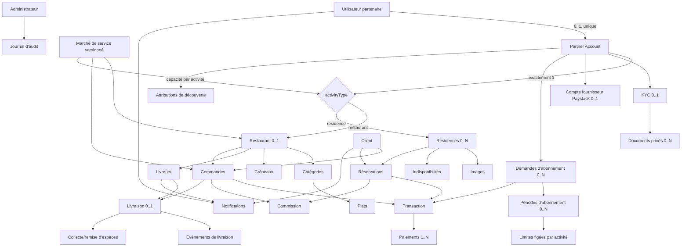
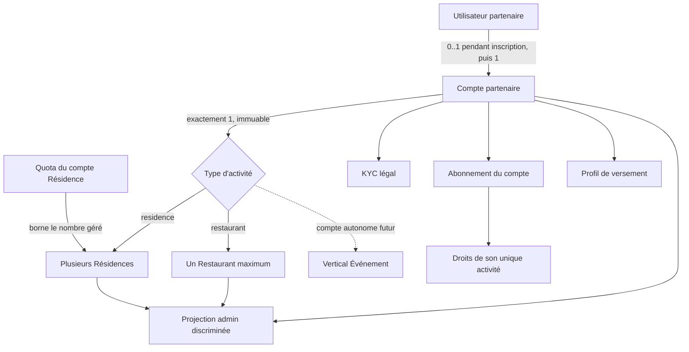

# Toutci — Référentiel relationnel et causal

- **Date de l'état observé :** 4 septembre 2026
- **Statut :** document de cadrage avant remédiation
- **Périmètre :** comptes, activités, entités exploitées, KYC, abonnements, paiements, commandes, réservations, commissions, livraisons, notifications, audit, géographie et découverte.

## 1. Verdict

La plateforme n'est pas encore cohérente de bout en bout pour une phase de test métier complète.

Les fondations financières récentes, la livraison, la géographie et la découverte possèdent plusieurs invariants corrects. En revanche, les projections administrateur et les effets transversaux ne suivent pas tous le contrat de compte désormais établi. Ce contrat est le suivant :

- **un compte partenaire porte exactement une activité** : Restaurant ou Résidence ;
- un compte Restaurant gère au maximum un seul Restaurant, entièrement autonome des autres Restaurants ;
- un compte Résidence peut gérer plusieurs Résidences, dans la limite de son quota ;
- plusieurs interfaces dites génériques restent en réalité codées uniquement pour le Restaurant et ne respectent donc pas cette distinction ;
- certaines commandes écrivent correctement leur objet principal sans produire toutes les conséquences attendues : audit, notification, navigation et visibilité administrateur ;
- des composants contiennent encore des simulations métier, même s'ils ne sont pas montés dans les parcours actifs observés ;
- les données de test ne sont pas identifiées structurellement et ont laissé de nombreuses projections orphelines.

Les contrôles TypeScript, ESLint, unitaires et d'architecture réussis ne contredisent pas ce verdict : ils vérifient la forme du code et des règles locales, pas la chaîne métier complète.

## 2. Règles désormais non négociables

### 2.1 Chaîne causale obligatoire

Toute action métier significative doit avoir un contrat vérifiable :

```text
acteur authentifié
  → commande métier autorisée et idempotente
  → écritures canoniques atomiques
  → événement métier corrélé
  → effets obligatoires (audit, notification, paiement, cache, push…)
  → projections visibles par les bons acteurs
  → scénario de test de bout en bout
```

Une écriture présente en base mais absente de l'administration est une chaîne incomplète. Une notification sans destination navigable est aussi une chaîne incomplète.

### 2.2 Classes de données

| Classe | Définition | Règle |
|---|---|---|
| Donnée canonique | État métier qui fait foi : compte, commande, période, transaction, réservation… | Persistée par son module propriétaire et protégée par des invariants. |
| Projection | Vue calculée pour un écran, une statistique ou une recherche. | Reconstructible depuis les sources canoniques ; jamais une vérité concurrente. |
| Preuve externe | Confirmation d'un fournisseur comme Paystack. | Conservée avec référence, montant, date, statut et corrélation vers la transaction. |
| Donnée de test | Donnée volontairement créée pour un scénario. | Isolée dans un environnement ou explicitement marquée `test`; jamais confondue avec une donnée réelle. |
| Simulation | Succès affiché sans écriture réelle ou contenu présenté comme réel sans source. | Interdite dans toutes les surfaces opérationnelles. |
| Illustration marketing | Contenu visuel statique ne prétendant pas être une opération réelle. | Autorisée seulement si elle est clairement présentée comme illustration. |

### 2.3 Source unique de vérité

- Un statut financier vient de `transactions` et `payments`, pas d'un message d'interface.
- Un abonnement actif vient d'une période effective, pas d'une bannière « offre supérieure ».
- Une entité rattachée vient de sa relation au compte partenaire, pas d'une colonne spécifique à un écran.
- Les statistiques doivent être calculées ou réconciliables. Un compteur mutable non maintenu ne peut pas faire foi.
- L'interface administrateur est une projection d'administration ; elle ne doit inventer ni masquer l'état métier.

## 3. Vocabulaire canonique

| Terme | Sens retenu |
|---|---|
| Utilisateur | Identité humaine de connexion pour un partenaire ou un administrateur. |
| Client | Consommateur qui commande ou réserve. Il possède actuellement une identité séparée de `users`. |
| Livreur | Compte opérationnel créé et géré par un Restaurant, avec ses propres identifiants. |
| Compte partenaire | Compte commercial autonome portant une seule activité, ses contrats et ses droits commerciaux. |
| Activité | Vertical métier activé pour un compte : Restaurant, Résidence et, plus tard seulement lorsqu'il existe réellement, Événement. |
| Entité exploitée | Établissement ou ressource commerciale concrète : un restaurant, une résidence ou un futur événement. |
| Ressource verticale | Objet propre à une activité : plat, catégorie, séjour, réservation, livreur… |
| KYC | Vérification du propriétaire légal du compte partenaire. |
| Abonnement | Contrat commercial du compte partenaire qui ouvre des droits par activité. |
| Transaction | Obligation financière interne rattachée à une seule source métier. |
| Paiement | Tentative et preuve de règlement d'une transaction. |
| Commission | Créance de Toutci issue d'une commande ou d'une réservation. |
| Événement métier | Trace causale d'une action, avec acteur, cible, date et corrélation. Ce n'est pas le futur vertical « Événement ». |
| Projection admin | Lecture agrégée multi-domaines destinée à l'administration. |

## 4. Acteurs et responsabilités actuels

| Acteur | Authentification actuelle | Peut agir sur | Limite observée |
|---|---|---|---|
| Partenaire Restaurant | `users` + session web/API + Partner Account `restaurant` | restaurant, profil, menu, commandes, livreurs, facturation, KYC | Le vocabulaire « restaurateur » est encore utilisé pour tous les partenaires dans plusieurs commandes admin. |
| Partenaire Résidence | `users` + même famille de session + Partner Account `residence` | résidences, disponibilités, réservations, facturation, KYC | Aucun centre de notifications web équivalent à celui du Restaurant. |
| Administrateur | `users.role = admin` | modération, comptes, abonnements, KYC, commissions, fournisseurs, zones | Le journal général exige toujours un `adminId`, même pour une action système. |
| Client | table et jetons `clients` | commandes, paiements, réservations, suivi, notifications | Compteurs de commandes et de dépenses non maintenus. |
| Livreur | table et jetons `livreurs` | disponibilité, offres, missions, preuve, espèces | Modèle d'événements plus rigoureux que le reste de l'application. |
| Système | cron, webhook, worker, fournisseur | confirmations, expirations, scans, effets différés | Pas d'identité d'acteur système dans le journal général ; certaines actions sont faussement attribuées à un admin. |
| Paystack | webhook/callback vérifié | confirmation ou échec d'un paiement | L'effet final dépend du type de transaction ; l'abonnement en ligne omet deux effets. |

## 5. Graphe du modèle réellement implémenté



Ce graphe décrit l'existant, pas la cible. Le futur vertical Événement n'a ni table, ni module, ni parcours. Il ne doit donc pas apparaître comme une capacité réellement disponible.

## 6. Cardinalités et propriétaires actuels

| Relation actuelle | Cardinalité | Source de vérité | État |
|---|---:|---|---|
| `users` → `partner_accounts` | 1 → 0..1 | `partner_accounts.user_id` unique | Structurellement protégée, mais deux partenaires sont encore sans compte après inscription. |
| Partner Account → activité | exactement 1, non interchangeable | `partner_accounts.activity_type` | Conforme au contrat produit clarifié. |
| Partner Account Restaurant → Restaurant | 1 → 0..1 pendant l'onboarding, puis exactement 1 | `restaurants.partner_account_id` unique | Cardinalité correcte ; trois comptes Restaurant n'ont pas encore de Restaurant dans la base observée. |
| Partner Account Résidence → Résidences | 1 → 0..N créées ; 0..quota publiées et visibles | `residences.partner_account_id` | Cardinalité correcte ; une racine Résidence n'a encore aucune résidence. Le code sélectionne déjà les candidates à la visibilité avant d'appliquer le quota ; ce prédicat doit devenir le contrat canonique testé. |
| Partner Account → KYC | 1 → 0..1 | contrainte unique KYC | Bon périmètre conceptuel ; application métier asymétrique. |
| Partner Account → compte Paystack | 1 → 0..1 par fournisseur | contrainte fournisseur/compte | Périmètre compte correct mais affectation aux différentes entités non explicite. |
| Partner Account → périodes d'abonnement | 1 → 0..N | périodes historiques | Une seule période payante active est permise. |
| Période → limites | 1 → N | snapshot des quotas de l'activité du compte | Structure compatible ; il faut rejeter toute limite d'une autre activité. |
| Restaurant → catégories/plats/créneaux/livreurs/commandes | 1 → N | tables verticales | Globalement clair ; une variante de création de plat ne revérifie pas la propriété de la catégorie. |
| Résidence → images/indisponibilités/réservations | 1 → N | tables verticales | Relations protégées par clés étrangères. |
| Client → commandes/réservations | 1 → N | commandes et réservations | Les compteurs dans `clients` dérivent de la réalité. |
| Transaction → source métier | exactement 1 | contrainte `transactions_source_coherent` | Bon invariant. |
| Transaction → paiements | 1 → N tentatives | `payments.transaction_id` | Bon support de reprise et d'idempotence. |
| Commande/Réservation → commission | 1 → 0..1 | index uniques partiels | Les nouvelles écritures sont cohérentes ; l'historique ne l'est pas. |
| Commande → livraison | 1 → 0..1 | `livraisons.commande_id` unique | Bon invariant. |
| Notification → destinataire | exactement 1 user/client/livreur | contrainte `singleOwner` | Bon invariant. |
| Notification → cible métier | lien texte polymorphe | `lien_type` + `lien_id` sans FK | 235 liens vers des ressources inexistantes dans la base observée. |
| Audit → acteur | exactement un administrateur | `audit_log.admin_id` | Faux pour cron, webhooks et autres acteurs. |
| Découverte → ressource | type + identifiant texte | `activity_type` + `resource_id` | Cohérente sur les lignes présentes, mais sans FK structurelle. |

Le schéma contient actuellement **49 tables applicatives**, auxquelles l'extension géographique ajoute sa table système. Ce nombre n'est pas un problème en soi ; le problème est l'absence d'un contrat commun d'effets et de projections entre ces domaines.

### 6.1 Inventaire des tables par responsabilité

| Domaine | Tables canoniques ou de projection persistée | Observation |
|---|---|---|
| Accès, identité et effets transversaux | `users`, `partner_accounts`, `partner_identity_verifications`, `partner_identity_documents`, `payment_provider_accounts`, `notifications`, `push_subscriptions`, `audit_log` | Trois familles d'identité restent séparées ; audit et destinations ne sont pas encore uniformes. |
| Géographie | `geo_source_areas`, `service_markets`, `service_market_versions`, `service_market_capabilities`, `service_market_version_areas` | Modèle versionné cohérent sur les lignes observées. |
| Restaurant et Résidence | `restaurants`, `residences`, `residence_images`, `residence_reservations`, `residence_unavailable_periods` | Deux verticaux distincts, avec cycles de validation différents. |
| Abonnements et découverte | `subscription_plans`, `subscription_plan_limits`, `subscription_plan_exposure_benefits`, `subscription_plan_feature_items`, `discovery_policy_settings`, `discovery_events`, `subscription_catalogue_draft`, `subscription_catalogue_revisions`, `subscription_requests`, `subscription_periods`, `subscription_period_limits` | Les limites sont typées par activité et doivent correspondre à l'unique activité du compte. |
| Exploitation Restaurant et Client | `creneaux_horaires`, `categories`, `plats`, `clients`, `commandes` | Promotions et avis ne participent pas au parcours actif de commande. |
| Finance et Livraison | `transactions`, `payments`, `livreurs`, `livraisons`, `delivery_offers`, `delivery_events`, `driver_cash_remittances`, `driver_cash_collections` | Les relations récentes sont les plus rigoureuses du système. |
| Commissions et engagement commercial | `promotions`, `avis`, `commissions`, `commission_settlements`, `commission_policy_settings`, `commission_debt_cycles`, `commission_settlement_allocations` | Les règlements manuels sont mieux instrumentés que leur équivalent Paystack. |

Les médias publics ne possèdent pas de registre canonique. La route d'envoi stocke une image R2 sous l'identifiant de l'utilisateur et retourne une URL ; le lien à un Restaurant, un Plat ou une Résidence n'existe que lorsqu'un formulaire enregistre ensuite cette URL. Un envoi abandonné peut donc devenir un objet de stockage orphelin, sans table d'asset ni cycle de suppression. Les documents KYC utilisent, eux, un stockage privé et des clés persistées dédiées.

## 7. Matrice action → écritures → conséquences

Légende : **OK** = chaîne observée cohérente ; **partiel** = écriture principale correcte mais effets/projections incomplets ; **rupture** = comportement trompeur, absent ou incompatible.

| Action | Écriture canonique actuelle | Conséquences attendues | État observé |
|---|---|---|---|
| Inscription partenaire | crée seulement `users` | session, compte identifiable, onboarding traçable | **Partiel** : Partner Account et entité sont créés plus tard dans deux commandes séparées, sans événement de parcours unifié. |
| Choisir une activité | crée `partner_accounts(activity_type)` | ouvrir le bon onboarding et verrouiller le vertical | **OK conceptuellement** : le choix mono-activité est voulu. Il doit rester immuable et être respecté par toutes les commandes/projections. |
| Créer un Restaurant | restaurant, catégories et éventuel premier plat | file de modération, projection compte, audit de création | **Partiel** : données réelles persistées, mais absence de journal métier unifié ; le premier plat est improprement nommé « démonstration ». |
| Créer une Résidence | résidence et images | file de modération, projection compte ; aucun quota tant qu'elle n'est pas visible | **Partiel** : relation et direction du quota correctes, mais projection Comptes et accès absente et prédicat canonique « publiée et visible » encore insuffisamment caractérisé par des tests transversaux. |
| Modifier un Restaurant validé | mise à jour du Restaurant | règle claire de remodération | **Asymétrique** : la validation reste généralement acquise ; seul un changement géographique peut modifier l'éligibilité. |
| Modifier une Résidence validée | mise à jour + effacement validation/publication | remodération | **OK localement**, mais comportement différent du Restaurant sans politique produit explicitée. |
| Valider/rejeter un Restaurant | statut + audit | notification, cache, visibilité | **Partiel** : validation/rejet notifient ; suspension/réactivation auditent mais ne notifient pas. |
| Valider/rejeter/suspendre une Résidence | statut + audit | notification, publication recalculée | **OK localement** ; les notifications destinées au partenaire Résidence ne sont pas consultables dans son espace web. |
| Soumettre un KYC | dossier et documents privés scannés | file admin, trace de soumission | **Partiel** : aucune notification/trace métier homogène de la soumission. |
| Consulter un justificatif KYC | lecture privée autorisée | aperçu sécurisé dans la page admin | **Rupture** : réponse `attachment`, donc téléchargement local forcé ; aucun lecteur intégré. |
| Décider un KYC | statut + audit | notification au partenaire, recalcul des éligibilités | **Partiel** : audit présent, notification absente. |
| Appliquer le KYC | garde d'éligibilité | même politique par activité ou exception documentée | **Rupture** : obligatoire pour publier une Résidence, non utilisé pour la visibilité Restaurant. |
| Demander un abonnement payant | demande + transaction + paiement Paystack | état en attente, reprise possible | **OK sur la source financière**. |
| Confirmer un abonnement Paystack | paiement confirmé + transaction payée + période + limites | audit, notification, visibilité admin financière | **Partiel critique** : période active créée, mais ni audit ni notification ; la table active ne montre pas les détails du paiement. |
| Valider un abonnement hors ligne | paiement confirmé + période + limites | audit + notification | **OK localement** : chaîne plus complète que le paiement en ligne. |
| Expirer un abonnement | période expirée + notification | audit par acteur système | **Rupture d'audit** : le cron emprunte le premier compte admin ; les périodes suspendues échues ne sont pas traitées. |
| Associer un subaccount Paystack | compte fournisseur du Partner Account | audit, information au partenaire, affectation explicite | **Partiel** : commande canonique et audit existent ; aucune notification, aucune affectation explicite par entité. La ligne runtime présente n'a pas d'audit correspondant. |
| Régler une dette de commission hors ligne | règlement + transaction + paiement + allocations | audit, rapprochement de dette | **OK localement** : l'audit contient paiement, référence et allocations. |
| Régler une dette de commission par Paystack | mêmes sources, puis confirmation et allocations | mêmes effets que le règlement hors ligne | **Partiel** : la confirmation alloue et réconcilie la dette, sans audit ni notification équivalents. |
| Créer une commande cash | commande + commission + transaction + tentative cash | notification, compteurs, suivi | **OK pour les nouvelles commandes**. |
| Créer une commande en ligne | mêmes sources, état paiement en attente | confirmation fournisseur avant effets | **OK pour les nouvelles commandes**. |
| Confirmer paiement de commande | paiement/transaction + libération commande | compteurs, notification, cache/SSE | **OK dans le chemin récent**. |
| Appliquer une promotion | devrait modifier remise, consommation et snapshot | total cohérent et audit d'usage | **Absente** : `remise` reste toujours zéro ; tables et mutations Promotions ne sont pas reliées au calcul actif. |
| Créer un avis | avis + recalcul notes | notification et projection publique | **Dormant** : table/mutations présentes, aucun parcours actif observé. |
| Créer une réservation Résidence | réservation + commission + transaction + paiement + notifications | calendrier, paiement, attribution | **OK dans le chemin récent**. |
| Annuler réservation par partenaire | annulation ; transaction/commission annulées si non payées | remboursement si payée, notifications | **Partiel** : le remboursement payé reste manuel mais est signalé. |
| Annuler réservation par client | annulation + notifications | même politique explicite de remboursement | **Rupture** : une réservation payée peut être annulée sans créer ni signaler une obligation de remboursement. |
| Proposer/accepter/exécuter une livraison | offre, mission, preuve et événements typés | notifications, cash et rémunération | **OK structurellement** sur les données observées. |
| Collecter/remettre les espèces | collecte et remise exactes + événements | visibilité Restaurant/Livreur | **OK structurellement** sur les données observées. |
| Suspendre un utilisateur/client | statut + révocation sessions + audit | information claire de l'effet | **Partiel** : conséquence d'accès correcte, mais vocabulaire « restaurateur » appliqué à tout partenaire et pas de notification dédiée. |
| Téléverser une image publique | objet R2 puis URL renvoyée | rattachement, propriété, suppression des abandons | **Partiel** : authentification et nettoyage du fichier présents, mais aucun asset persistant ne relie l'objet à sa cible finale. |
| Afficher les remboursements au support | devrait lire des remboursements canoniques | nombre et dossier consultable | **Rupture** : aucun domaine de remboursement ; le compteur admin est codé à zéro. |
| Enregistrer une notification | propriétaire unique | destination stable et navigable | **Rupture transversale** : cibles texte non protégées, résolveur incomplet, espace Résidence absent. |
| Enregistrer une action système | événement avec acteur `system` | audit fidèle | **Rupture transversale** : le journal général ne sait représenter qu'un administrateur. |

## 8. Les trois constats signalés, établis précisément

### 8.1 Documents KYC

- La route admin ajoute `Content-Disposition: attachment`.
- La page de revue rend un lien ouvrant cette route, pas un lecteur d'image/PDF.
- Le navigateur télécharge donc le document privé au lieu de le présenter dans l'espace contrôlé.

**Contrat cible :** aperçu intégré, authentifié, `no-store`, sans URL publique ; bouton Télécharger séparé seulement si une politique explicite l'autorise, avec trace d'audit.

### 8.2 Comptes et accès

- La requête joint `users` → Partner Account → `restaurants`, mais ne projette pas les Résidences.
- La cellule s'appelle « Restaurant & offre ».
- Si `restaurantId` est nul, elle affiche « Aucun restaurant associé » et masque également l'offre pourtant jointe au Partner Account.

**Conclusion :** ce n'est pas une absence de rattachement en base pour le compte Résidence observé ; c'est une projection générique construite autour d'une relation Restaurant.

### 8.3 Paiement de 25 000 FCFA

Le contrôle en lecture seule confirme :

- transaction d'abonnement payée ;
- tentative Paystack mobile money confirmée ;
- montant 25 000 FCFA ;
- demande Croissance validée ;
- période Résidence active jusqu'au 4 septembre 2027 ;
- limites d'abonnement créées.

La source financière et le droit commercial existent. L'incohérence vient de leurs conséquences :

- aucune action `abonnement_valide` dans l'audit ;
- aucune notification d'abonnement ;
- la demande quitte l'onglet « Demandes », qui est l'onglet par défaut ;
- l'abonnement est visible dans « Abonnés », mais sans montant, fournisseur, référence ni statut de paiement ;
- « Comptes et accès » le masque parce qu'aucun Restaurant n'est attaché à ce Partner Account Résidence.

La transaction observée appartient au Partner Account **Résidence**. Selon le contrat mono-activité désormais établi, elle ne doit pas être synchronisée vers un compte Restaurant. Si le paiement a réellement été initié depuis une session Restaurant, son rattachement au compte Résidence constitue alors une anomalie d'attribution de compte. L'état final de la base ne permet pas, à lui seul, de prouver quelle session était active au début du parcours ; la future trace corrélée devra enregistrer le compte initiateur dès la création de la demande.

## 9. État factuel de la base de développement

Contrôles agrégés réalisés en transaction `READ ONLY`, sans afficher de donnée personnelle :

| Contrôle | Résultat |
|---|---:|
| Utilisateurs / Partner Accounts | 15 / 12 |
| Partenaires sans Partner Account | 2 |
| Partner Account appartenant à un admin | 1 |
| Comptes Restaurant sans Restaurant | 3 |
| Comptes Résidence sans Résidence active/non archivée | 1 |
| Restaurants / Résidences | 6 / 2 |
| Dossiers KYC | 2, tous vérifiés et tous sur activité Résidence |
| Périodes d'abonnement | 5 historiques, dont 1 Croissance Résidence active payée 25 000 FCFA |
| Commandes | 37 |
| Commandes sans transaction | 2 |
| Commandes sans commission | 34 |
| Clients dont le compteur de commandes diverge | 5 |
| Clients dont le total dépensé diverge | 3 |
| Notifications | 323 |
| Notifications à cible métier connue devenue inexistante | 235 |
| Événements de découverte | 305 : 304 impressions Restaurant, 1 impression Résidence, aucun clic/détail/conversion observé |

Les 235 notifications orphelines concernent 95 liens Commande, 48 Réservation Résidence, 91 Résidence et 1 Restaurant. Elles indiquent probablement des nettoyages de données de test sans nettoyage des projections, ce que l'absence de marqueur structurel `test` empêche de prouver proprement.

Les invariants suivants sont corrects sur les lignes actuelles :

- aucun paiement confirmé n'est rattaché à une transaction non payée ;
- aucun montant de paiement ne diffère du montant de sa transaction ;
- aucune période payante validée ne manque sa période ou ses limites attendues ;
- aucune ressource de découverte présente ne pointe vers le mauvais propriétaire ;
- aucune version de marché présente ne pointe vers le mauvais marché ;
- aucune offre, collecte ou trace de livraison présente ne mélange Restaurant, commande et livreur.

## 10. Simulations et données non réelles

### 10.1 Simulations métier interdites trouvées

| Composant | Simulation | Accessibilité observée |
|---|---|---|
| `StepSocials.tsx` | délai artificiel puis URL sociale factice présentée comme connexion | Non importé par l'onboarding actif. |
| `reviews-section.tsx` | faux avis « Client vérifié » et soumission réussie seulement en mémoire | Non importé par une page active. |
| `reserve-modal.tsx` | fausse réservation de table, confirmation et SMS annoncés sans backend | Non importé par une page active. |
| `gallery-section.tsx` | galerie statique identique indépendamment du Restaurant | Non importé par une page active. |

Ces composants dormants restent dangereux : une importation future réactiverait des mensonges métier sans signal d'alerte. Ils doivent être supprimés du produit ou déplacés dans un espace Storybook/démonstration explicitement exclu des builds opérationnels.

### 10.2 Éléments qui ne sont pas des simulations métier

- skeletons de chargement ;
- délais de debounce/reconnexion ;
- animations aléatoires purement décoratives ;
- placeholders de formulaires ;
- illustration marketing clairement non interactive.

### 10.3 Données de test

Des noms/emails contenant des motifs test, démo, fixture ou E2E existent, mais aucune origine de donnée n'est stockée. La cible doit utiliser au minimum une séparation d'environnement stricte et, si des scénarios partagent une base de développement, un `test_scenario_id` ou `data_origin` non ambigu.

## 11. Causes racines

1. **Contrat mono-activité insuffisamment propagé.** Le schéma porte correctement `activity_type`, mais plusieurs écrans et effets ne traitent pas explicitement les deux variantes du compte.
2. **Projection Restaurant présentée comme générique.** « Comptes et accès » connaît `restaurantId`, mais ne sait pas projeter la collection de Résidences d'un compte Résidence.
3. **Effets non contractualisés.** L'activation d'abonnement manuelle et l'activation Paystack aboutissent au même état principal mais pas au même audit ni aux mêmes notifications.
4. **Commandes dispersées.** Une partie des règles vit dans les modules, une autre dans les Server Actions et `src/lib` legacy. Deux chemins vers la même intention peuvent diverger.
5. **Audit centré administrateur.** Webhook, cron, partenaire, client et livreur n'ont pas de représentation uniforme.
6. **Liens polymorphes non protégés.** Notifications, audit et découverte utilisent des identifiants texte sans intégrité référentielle complète.
7. **Projections mutables non réconciliées.** Compteurs Client, Restaurant et Plat peuvent dériver de l'historique réel.
8. **Migrations historiques incomplètes.** Des commandes précèdent l'introduction des transactions et commissions sans backfill exhaustif.
9. **Absence de frontière de données de test.** Le nettoyage de fixtures laisse des objets transversaux orphelins.
10. **Fonction Support sans source.** L'administration affiche un signal de remboursements alors qu'aucune écriture canonique ne le nourrit.
11. **Médias sans registre d'asset.** L'objet de stockage précède son rattachement métier et peut rester orphelin.
12. **Tests trop locaux.** 354 tests passent et 30 sont ignorés, mais aucun contrat transversal n'imposait les conséquences relevées ici.

## 12. Modèle cible recommandé

### 12.1 Compte, activités et entités



Règles établies :

- `partner_accounts.activity_type` reste la discrimination canonique et immuable du compte.
- Un compte Restaurant ne peut créer, posséder ou administrer aucune Résidence.
- Un compte Restaurant possède au maximum un Restaurant. Après onboarding terminé, il doit en posséder exactement un.
- Chaque Restaurant est autonome : abonnement, KYC, versement, commandes, menu, livreurs, commissions et administration ne sont jamais partagés avec un autre Restaurant.
- Si une même personne physique possède plusieurs Restaurants, chacun requiert un compte partenaire autonome. Un éventuel accès unique à plusieurs comptes serait une fonctionnalité d'accès séparée ; il ne fusionnerait jamais leurs données métier.
- Un compte Résidence ne peut créer, posséder ou administrer aucun Restaurant.
- Un compte Résidence possède plusieurs Résidences, dans la limite de son quota.
- Le quota compte uniquement les Résidences **publiées et réellement visibles dans l'application**. Une Résidence brouillon, suspendue, non validée, archivée ou autrement non visible ne consomme aucune place. Retirer une Résidence de la visibilité libère une place.
- L'administration utilise un type discriminé : `{activityType: "restaurant", restaurant}` ou `{activityType: "residence", residences[]}`. Elle ne doit ni chercher un Restaurant sur un compte Résidence, ni inventer une entité générique en base.
- Le futur vertical Événement aura ses propres comptes mono-activité et ses propres cardinalités. Il ne devient sélectionnable qu'après existence de son module, de son schéma, de ses parcours et de ses tests.

### 12.2 Périmètre recommandé du KYC

- Le KYC appartient au Compte partenaire, donc au propriétaire légal.
- Une validation couvre l'unique activité et les entités permises dans ce compte : un Restaurant ou plusieurs Résidences.
- Des documents spécifiques à une entité pourront exister plus tard, mais ne doivent pas être confondus avec l'identité du propriétaire.
- Toute décision KYC produit : état, audit, notification, invalidation/recalcul des éligibilités et projection admin.

### 12.3 Périmètre recommandé de l'abonnement

- L'abonnement payant appartient au Compte partenaire.
- Il s'applique uniquement à l'activité de ce compte. Un paiement Restaurant n'active jamais un compte Résidence distinct, et inversement.
- Pour Restaurant, l'unique Restaurant du compte hérite de l'offre.
- Pour Résidence, toutes les Résidences du compte partagent l'offre et le quota du compte.
- Les droits et quotas restent exprimés par activité et type de ressource ; les snapshots d'une période ne doivent contenir que l'activité du compte.
- Chaque entité affiche qu'elle **hérite** de l'offre du compte, sans posséder une copie concurrente du statut.
- Une activation, quel que soit le moyen de paiement, doit appeler la même commande de finalisation et produire exactement les mêmes effets.
- Le Partner Account est toujours dérivé de la session authentifiée lors de la demande et du paiement. Il ne peut pas venir d'un choix d'interface ambigu ou d'un identifiant libre envoyé par le client.

### 12.4 Paiements et versements

- La Transaction reste la source financière interne et conserve exactement une source métier.
- Le Paiement conserve chaque tentative fournisseur et sa référence.
- L'administration expose un journal financier : montant, moyen, fournisseur, référence, dates, statut, source métier, compte bénéficiaire et période/droit créé.
- Le profil de versement Paystack appartient au Compte partenaire.
- Pour un compte Restaurant, ce profil ne concerne que son Restaurant.
- Pour un compte Résidence, le profil est partagé par défaut entre ses Résidences. Une éventuelle dérogation par Résidence devra être une décision produit explicite, jamais un effet implicite de la page depuis laquelle l'admin agit.
- Un remboursement devient une entité financière liée au paiement d'origine, avec montant, motif, initiateur, fournisseur, référence, statut et dates. Une annulation payée ne peut être finalisée sans cette obligation.

### 12.5 Médias

- Un asset public possède un identifiant, un propriétaire, un statut temporaire/rattaché, une cible typée éventuelle, une clé de stockage et une date d'expiration.
- Le rattachement de l'asset à l'entité est atomique avec la commande qui enregistre cette entité.
- Un job supprime les uploads temporaires non rattachés après délai.
- Les documents KYC restent dans un stockage privé séparé et ne réutilisent jamais une URL publique.

### 12.6 Événements, audit et notifications

Chaque commande critique émet dans la même transaction un événement avec :

- `event_id` et `correlation_id` ;
- type de commande et résultat ;
- acteur `{actor_type, actor_id}` où le type accepte admin, partner user, client, driver, system et provider ;
- compte partenaire et cible typée ;
- horodatage ;
- détails non sensibles nécessaires à la preuve.

Une outbox transactionnelle déclenche les effets externes. Audit et notifications deviennent des projections de cet événement, avec reprise idempotente. Les notifications conservent une destination typée et un comportement explicite si la ressource a été archivée.

### 12.7 Administration générique

La ligne « Comptes et accès » doit afficher :

- utilisateur propriétaire et état d'accès ;
- Compte partenaire ;
- activité unique et immuable ;
- pour Restaurant : l'unique Restaurant et son statut ;
- pour Résidence : le nombre, le quota et la liste des Résidences avec leur statut ;
- état KYC ;
- offre effective et échéance ;
- dernier paiement et accès au journal financier ;
- profil de versement ;
- état de suspension du compte et de chaque entité.

L'absence d'entité doit être formulée selon le type : « Restaurant non encore créé » ou « Aucune résidence créée ». Un compte Résidence ne doit jamais être évalué par l'absence d'un Restaurant.

## 13. Invariants cibles

1. Un Partner Account appartient à un utilisateur partenaire et n'est jamais rattaché à un administrateur.
2. Après onboarding, un utilisateur partenaire possède exactement un Partner Account.
3. Un Partner Account possède exactement un `activity_type`, immuable : `restaurant` ou `residence`.
4. Un compte Restaurant possède au maximum un Restaurant et ne possède aucune Résidence.
5. Un compte Résidence peut posséder zéro à N Résidences et ne possède aucun Restaurant ; seules ses Résidences publiées et réellement visibles sont bornées par le quota.
6. Deux comptes Restaurant restent entièrement autonomes : aucune donnée métier, aucun abonnement et aucun paiement ne sont partagés implicitement.
7. Une ressource enfant appartient au même vertical, au même compte et à la même entité que son parent. Cette règle doit être validée par commande et, si possible, contrainte en base.
8. Une transaction possède exactement une source et le même Partner Account que cette source.
9. Un paiement initié depuis une session est obligatoirement rattaché au Partner Account de cette session.
10. Un paiement confirmé a le même montant/devise que la transaction et rend son effet métier idempotent.
11. Une période payante active possède sa transaction payée, son paiement confirmé et les limites de l'unique activité du compte.
12. Une même intention d'activation produit les mêmes audit, notification et projection, quel que soit le canal de paiement.
13. Une commission possède exactement une source, le même Partner Account et un taux figé.
14. Une annulation payée crée une obligation de remboursement traçable ; elle ne se contente pas d'un message.
15. Une notification possède exactement un destinataire et une destination exploitable ou un état « cible archivée » explicite.
16. Une action automatique porte l'acteur `system` ou `provider`, jamais l'identité arbitraire d'un administrateur.
17. Un compteur dénormalisé possède un mécanisme de mise à jour, de recalcul et de détection de dérive.
18. Toute donnée de test est identifiable sans analyser son nom ou son email.
19. Aucun succès métier ne peut être affiché sans écriture canonique confirmée.
20. Un média public est temporaire ou rattaché à une cible valide ; un document KYC reste privé.

## 14. Priorités de remédiation

### P0 — bloquants avant reprise des tests métier

1. Inscrire le contrat mono-activité dans les contrats métier et refuser systématiquement tout croisement Restaurant/Résidence.
2. Centraliser le prédicat « Résidence publiée et réellement visible », refuser toute publication qui dépasserait le quota et libérer une place dès qu'une Résidence cesse d'être visible.
3. Réconcilier les Partner Accounts invalides ou incomplets présents en base.
4. Remplacer la projection Restaurant de « Comptes et accès » par une projection discriminée Restaurant/Résidence.
5. Garantir que toute demande et tout paiement dérivent leur Partner Account de la session authentifiée.
6. Unifier la finalisation des abonnements en ligne/hors ligne et exposer le journal financier admin.
7. Intégrer l'aperçu sécurisé KYC et notifier les décisions.
8. Donner au partenaire Résidence un centre de notifications et des destinations navigables.
9. Créer une obligation de remboursement pour toute annulation payée.
10. Retirer le faux signal « remboursements » tant que son registre financier n'existe pas, puis créer le vrai domaine.
11. Fermer la variante de création de plat qui permet techniquement une catégorie d'un autre Restaurant.
12. Désactiver/supprimer les simulations métier dormantes des builds applicatifs.
13. Isoler les données de test et réconcilier les notifications orphelines.

### P1 — cohérence opérationnelle

1. Remplacer l'audit admin-only par un acteur typé et un identifiant de corrélation.
2. Harmoniser les politiques KYC et de remodération Restaurant/Résidence.
3. Recalculer ou supprimer les compteurs Client/Restaurant/Plat non fiables.
4. Backfiller ou marquer explicitement les commandes historiques sans transaction/commission.
5. Soit relier Promotions et Avis à des parcours réels, soit les retirer des promesses fonctionnelles.
6. Rendre les liens de notification exhaustifs et stables.
7. Traiter l'expiration des périodes suspendues sans faux acteur admin.
8. Créer un registre de médias publics et nettoyer les uploads abandonnés.

### P2 — réduction de dette architecturale

1. Finir la migration des règles métier hors de `src/lib` et des adaptateurs `app`.
2. Réduire les 108 dépendances App → DB actuellement acceptées par baseline.
3. Générer les projections admin depuis des contrats de lecture versionnés par module.
4. Ajouter une réconciliation planifiée des invariants financiers, compteurs et destinations.

## 15. Ordre de migration sûr

1. Geler les nouvelles fonctionnalités et valider ce référentiel.
2. Écrire les scénarios de parcours attendus avant le schéma cible.
3. Formaliser les deux variantes discriminées du compte dans `partners/model.ts` et `contracts.ts`.
4. Ajouter les validations et contraintes manquantes sans retirer `activity_type` ni l'unicité Restaurant/compte.
5. Réconcilier les comptes existants et produire un rapport des états incomplets ou invalides.
6. Introduire la projection admin discriminée et comparer ancien/nouveau résultat.
7. Centraliser les commandes de finalisation d'abonnement, KYC et annulation payée.
8. Ajouter événement corrélé + outbox, puis migrer les notifications/audits domaine par domaine.
9. Réconcilier les données historiques et isoler les fixtures.
10. Basculer toutes les lectures vers le contrat mono-activité vérifié.

## 16. Matrice minimale de tests d'acceptation

| Scénario | Preuves obligatoires |
|---|---|
| Inscription Restaurant terminée | un Partner Account `restaurant`, exactement un Restaurant visible dans Comptes et accès. |
| Un compte Restaurant tente d'ajouter un second Restaurant | refus avant écriture ; aucune relation partagée n'est créée. |
| Un compte Restaurant tente d'ajouter une Résidence | refus avant écriture. |
| Inscription Résidence terminée | un Partner Account `residence`, première Résidence visible dans Comptes et accès. |
| Un compte Résidence ajoute plusieurs Résidences | créations et brouillons non visibles non bornés ; compteur et liste administrateur exacts. |
| Un compte Résidence atteint puis dépasse son quota visible | publication autorisée jusqu'au quota puis refusée avant la mise en visibilité ; retrait de visibilité libérant immédiatement une place. |
| Un compte Résidence tente d'ajouter un Restaurant | refus avant écriture. |
| KYC soumis puis validé | aperçu inline, audit, notification, éligibilités recalculées. |
| Paiement Paystack 25 000 FCFA | paiement confirmé, transaction payée, période active, limites, audit, notification, ligne admin financière. |
| Paiement hors ligne équivalent | exactement les mêmes effets finaux, seule la preuve de paiement diffère. |
| Offre Restaurant | une seule source d'abonnement, héritée uniquement par l'unique Restaurant du compte. |
| Offre Résidence | une seule source d'abonnement, quota partagé par toutes les Résidences du compte. |
| Paiement initié depuis chaque type de compte | la transaction conserve exactement le Partner Account de la session ; aucun droit ne traverse vers un autre compte. |
| Commande cash et commande en ligne | montants, commission, transaction, notifications et compteurs cohérents. |
| Réservation payée annulée par chaque acteur | obligation/remboursement traçable, statuts financiers et notifications cohérents. |
| Livraison avec espèces | preuve, collecte, remise, rémunération et événements corrélés. |
| Règlement de commission hors ligne/Paystack | mêmes allocations, audit, notification et solde final quel que soit le canal. |
| Upload abandonné | asset temporaire identifiable puis supprimé automatiquement. |
| Suppression/archivage d'une fixture | aucune notification cassée dans une surface réelle ; origine test explicite. |
| Action cron/webhook | acteur système/fournisseur correct, aucun admin fictif. |
| Tentative d'utiliser une catégorie étrangère | refus avant écriture et contrainte d'intégrité vérifiée. |

## 17. Décisions produit

### 17.1 Décisions entérinées

1. **Un compte égale une activité.** Aucun compte ne mélange Restaurant et Résidence.
2. **Compte Restaurant : un Restaurant maximum.** Chaque Restaurant possède son compte autonome et ne partage implicitement aucune donnée avec un autre Restaurant.
3. **Compte Résidence : plusieurs Résidences.** Le quota borne uniquement le nombre de Résidences publiées et réellement visibles ; les brouillons et autres Résidences non visibles ne comptent pas.
4. **Abonnement au niveau du compte mono-activité.** Il bénéficie à l'unique Restaurant ou à l'ensemble des Résidences de ce compte, selon son type.
5. **Aucune synchronisation entre comptes distincts.** Un paiement Restaurant n'active pas un compte Résidence et un paiement d'un Restaurant n'active pas un autre Restaurant.
6. **KYC au niveau du compte.** Il couvre les entités autorisées de ce compte sans traverser vers un compte autonome.
7. **Zéro simulation opérationnelle.** Les démonstrations vivent hors des routes produit et les fixtures sont identifiées.
8. **Versement Résidence V1 : profil commun.** Le profil Paystack appartient au Partner Account et est partagé par toutes ses Résidences.

### 17.2 Précisions restantes

1. Si une même personne physique possède plusieurs Restaurants autonomes, doit-elle utiliser plusieurs identifiants de connexion ou disposer plus tard d'un sélecteur d'accès vers plusieurs comptes sans partage métier ?

Aucun correctif de comportement n'a été appliqué dans le cadre de cet audit.

## 18. Preuves principales dans le code

- Modèle mono-activité : `src/modules/partners/model.ts`, `contracts.ts`, `server.ts` et `src/lib/db/schema.ts`.
- Projection Restaurant de Comptes et accès : `src/lib/db/queries-admin.ts` et `src/components/admin/users-admin-table.tsx`.
- Téléchargement KYC forcé : `src/app/api/admin/identity/documents/[id]/route.ts`.
- Absence de lecteur KYC : `src/app/(dashboard)/admin/verifications/[id]/page.tsx`.
- Divergence activation abonnement : `src/modules/subscriptions/server.ts`.
- Projection admin abonnement incomplète : `src/app/(dashboard)/admin/abonnements/page.tsx` et `src/components/admin/abonnements/abonnes-table.tsx`.
- Annulation Résidence payée : `src/modules/residences/server.ts`.
- Audit admin-only et liens notification polymorphes : `src/lib/db/schema.ts`.
- Promotion non appliquée : `src/lib/orders/restaurant-order-intent.ts`.
- Compteurs clients non maintenus : `src/lib/db/schema.ts` et chemins de commande.
- Simulations dormantes : `src/components/onboarding/StepSocials.tsx`, `src/components/public-page/reviews-section.tsx`, `reserve-modal.tsx` et `gallery-section.tsx`.
